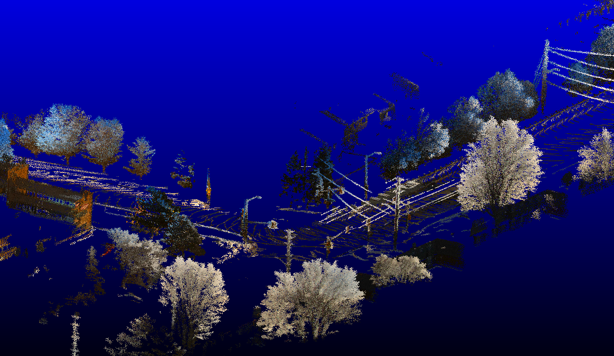
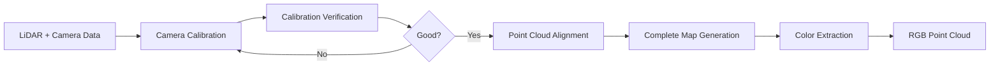

# Camera-LiDAR Calibration & Point Cloud Colorization Pipeline

[](https://www.python.org/downloads/)
[](https://opensource.org/licenses/MIT)
[](http://www.open3d.org/)
[](https://opencv.org/)

A complete pipeline for calibrating cameras to LiDAR sensors and generating RGB-colored point clouds from multi-camera systems. This toolkit provides interactive calibration tools, verification utilities, and an automated colorization pipeline that fuses data from multiple cameras.

<div align="center">

## 🎨 Results

### Dual-Camera Fusion


*Point cloud colored using both primary and secondary cameras with enhanced saturation*

### Single Camera Colorization


*Point cloud colored using primary camera only*

### Calibration Verification
<table>
  <tr>
    <td width="50%">
      
      <p align="center"><em>Primary camera calibration verification</em></p>
    </td>
    <td width="50%">
      
      <p align="center"><em>Secondary camera calibration verification</em></p>
    </td>
  </tr>
</table>

</div>

---

## ✨ Features

- 🎯 **Interactive Point-Picking Calibration** - Manual correspondence selection with visual feedback
- 🔍 **Multiple PnP Solvers** - ITERATIVE, EPNP, SQPNP, P3P with RANSAC support
- 📹 **Multi-Camera Fusion** - Combine colors from multiple cameras for better coverage
- 🌈 **Color Enhancement** - Adjustable saturation boost and gamma correction
- ✅ **Calibration Verification** - Visual overlay tools to validate alignment quality
- 🗺️ **KISS-ICP Integration** - Automatic point cloud alignment and odometry
- 💾 **Field Preservation** - Maintains intensity and custom scalar fields
- 🎨 **High-Saturation Visualization** - Intensity-based coloring for easier point identification

---

## 📋 Table of Contents

- [Installation](#-installation)
- [Quick Start](#-quick-start)
- [Pipeline Overview](#-pipeline-overview)
- [Detailed Usage](#-detailed-usage)
- [Data Structure](#-data-structure)
- [Calibration File Format](#-calibration-file-format)
- [Mathematical Framework](#-mathematical-framework)
- [Troubleshooting](#-troubleshooting)
- [Citation](#-citation)
- [License](#-license)

---

## 🚀 Installation

### Prerequisites

- Python 3.8 or higher
- CUDA-capable GPU (optional, for faster processing)

### Install Dependencies

```bash
# Clone the repository
git clone https://github.com/yourusername/camera-lidar-calibration.git
cd camera-lidar-calibration

# Create virtual environment (recommended)
python -m venv venv
source venv/bin/activate  # On Windows: venv\Scripts\activate

# Install required packages
pip install numpy opencv-python open3d scipy tqdm imageio kiss-icp
```

### Package Versions (Tested)

```
numpy>=1.21.0
opencv-python>=4.5.0
open3d>=0.17.0
scipy>=1.7.0
tqdm>=4.62.0
imageio>=2.9.0
kiss-icp>=0.2.0
```

---

## ⚡ Quick Start

```bash
# 1. Calibrate cameras
python calibrate_point_picking.py --camera primary --frame 0

# 2. Verify calibration
python visualize_walkley_calibration.py --camera primary

# 3. Align point clouds
kiss_icp_pipeline --visualize "path/to/PointCloudsIntensity"

# 4. Generate complete map
python saving_map.py

# 5. Colorize with dual-camera fusion
python colorize_pointcloud.py \
    --use_both_cameras \
    --saturation_boost 2.5 \
    --gamma 0.75 \
    --no-include_all_points

# 6. Visualize result
open3d results/latest/walkley_colored_map.pcd
```

---

## 🔄 Pipeline Overview



### Five-Stage Pipeline

1. **Camera-LiDAR Calibration** - Establish geometric relationship between sensors
2. **Verification** - Validate calibration quality with visual overlays
3. **Point Cloud Alignment** - Compute odometry and global map using KISS-ICP
4. **Map Reconstruction** - Rebuild complete map preserving all fields
5. **Colorization** - Project aligned map to camera frames and extract RGB

---

## 📖 Detailed Usage

### Stage 1: Camera-LiDAR Calibration

Interactive point-picking tool to establish 3D-2D correspondences.

**Primary Camera:**
```bash
python calibrate_point_picking.py \
    --camera primary \
    --frame 0 \
    --use_checkerboard
```

**Secondary Camera:**
```bash
python calibrate_point_picking.py \
    --data_dir "path/to/walkley data" \
    --camera secondary \
    --initial_calib walkley_secondary_calibration.txt \
    --frame 1
```

**Interactive Controls:**
| Key | Action |
|-----|--------|
| `P` | Pick point in 3D point cloud (Shift+Click in viewer) |
| Click | Select corresponding point in 2D image |
| `C` | Compute calibration (requires ≥4 point pairs) |
| `U` | Undo last point pair |
| `R` | Reset all points |
| `S` | Save calibration file |
| `Q` | Quit |

**Tips for Best Results:**
- Use at least 6 point pairs for RANSAC robustness
- Spread points across the entire image
- Pick distinct, unambiguous features (corners, edges)
- Avoid coplanar configurations
- Use checkerboard data when available for higher accuracy

### Stage 2: Calibration Verification

Visualize calibration quality by projecting LiDAR points onto camera images.

**Generate Verification Frames:**
```bash
# Primary camera
python visualize_walkley_calibration.py \
    --camera primary \
    --calib_file walkley_primary_calibration.txt \
    --output_dir walkley_calibration_check_primary \
    --max_frames 100 \
    --point_size 3

# Secondary camera
python visualize_walkley_calibration.py \
    --camera secondary \
    --calib_file walkley_secondary_calibration.txt \
    --output_dir walkley_calibration_check_secondary
```

**Create Verification Video/GIF:**
```bash
# Create GIF (recommended for documentation)
python create_video_from_frames.py \
    --input_dir walkley_calibration_check_primary \
    --output calibration_check_primary.gif \
    --fps 5

# Create MP4 video
python create_video_from_frames.py \
    --input_dir walkley_calibration_check_primary \
    --output calibration_check_primary.mp4 \
    --fps 10
```

Points are colored by depth: **blue** (near) → **green** (medium) → **red** (far)

### Stage 3: Point Cloud Alignment

Use KISS-ICP for LiDAR odometry and global map generation.

```bash
kiss_icp_pipeline --visualize "path/to/PointCloudsIntensity"
```

**Output:**
- `results/latest/PointCloudsIntensity_poses.npy` - 4×4 transformation matrices
- `results/latest/complete_map.pcd` - Aligned point cloud
- `results/latest/config.yml` - KISS-ICP configuration

### Stage 4: Complete Map Generation

Rebuild map with all fields (intensity, labels) preserved.

```bash
python saving_map.py
```

This script:
1. Loads poses from `PointCloudsIntensity_poses.npy`
2. Transforms each frame to global coordinates
3. Concatenates all points
4. Preserves intensity and scalar_label fields

**Output:** `results/latest/Walkley_complete_full.pcd`

### Stage 5: Point Cloud Colorization

Extract RGB colors by projecting aligned map to camera frames.

**Dual-Camera Fusion (Recommended):**
```bash
python colorize_pointcloud.py \
    --use_both_cameras \
    --saturation_boost 2.5 \
    --gamma 0.75 \
    --no-include_all_points
```

**Single Camera:**
```bash
python colorize_pointcloud.py \
    --camera primary \
    --saturation_boost 2.0 \
    --gamma 0.8
```

**Advanced Options:**
```bash
python colorize_pointcloud.py \
    --data_dir "path/to/walkley data" \
    --calib_file walkley_primary_calibration.txt \
    --secondary_calib_file walkley_secondary_calibration.txt \
    --results_dir results/latest \
    --output results/latest/colored_map.pcd \
    --use_both_cameras \
    --saturation_boost 2.5 \
    --gamma 0.75 \
    --no-include_all_points
```

**Parameters:**

| Parameter | Type | Default | Description |
|-----------|------|---------|-------------|
| `--use_both_cameras` | flag | False | Fuse colors from primary and secondary cameras |
| `--camera` | str | 'primary' | Which camera to use if not using both |
| `--saturation_boost` | float | 2.0 | Color vibrancy multiplier (1.0-3.0 recommended) |
| `--gamma` | float | 0.8 | Gamma correction (< 1.0 brightens, > 1.0 darkens) |
| `--include_all_points` | flag | True | Include all points (use --no-include_all_points for colored only) |

**Output:** `results/latest/walkley_colored_map.pcd`
- RGB colors (0-1 range)
- Original intensity field
- Original scalar_label field
- Statistical outliers removed

---

## 📁 Data Structure

```
walkley data/
├── PointCloudsIntensity/    # LiDAR scans (*.pcd)
│   ├── 00000.pcd
│   ├── 00001.pcd
│   └── ...
├── primaryImages/           # Primary camera frames (*.png)
│   ├── 00000.png
│   ├── 00001.png
│   └── ...
└── secondaryImages/         # Secondary camera frames (*.png)
    ├── 00000.png
    ├── 00001.png
    └── ...

calibration/                 # Optional: Checkerboard calibration data
├── PointClouds/
├── primaryImages/
└── secondaryImages/
```

---

## 📝 Calibration File Format

Calibration files are human-readable text files containing camera intrinsics and extrinsics:

```
# Walkley Dataset Calibration - primary camera
# Frame used: 1

# Camera Intrinsics (K)
2018.1000000000017 0.0 960.0
0.0 2018.1000000000017 600.0
0.0 0.0 1.0

# Rotation Matrix (R)
-0.011553342828645775 -0.9997804802942524 0.017478887037728572
-0.010602642995305752 -0.017356585586652026 -0.9997931450546593
0.9998770445564784 -0.011736275361762766 -0.010399788922617953

# Translation Vector (t)
0.2515451343777162 -0.053525501067545826 -0.009094872369760159

# Euler Angles (degrees)
Roll: -131.54490567620832
Pitch: -89.10150438773171
Yaw: -137.45701971206634
```

**Files Generated:**
- `walkley_primary_calibration.txt` - Primary camera extrinsics
- `walkley_secondary_calibration.txt` - Secondary camera extrinsics

---

## 🧮 Mathematical Framework

### Projection Equation

For a 3D point **P**<sub>lidar</sub> in LiDAR frame, projection to pixel **p** in camera image:

**1. Transform to camera frame:**

   ```
   P_cam = R × P_lidar + t
   ```

**2. Project to image plane:**

   ```
   p_homogeneous = K × P_cam
   p = [p_x / p_z, p_y / p_z]
   ```

Where:
- **K** - 3×3 camera intrinsic matrix (focal length, principal point)
- **R** - 3×3 rotation matrix (LiDAR → camera frame)
- **t** - 3×1 translation vector

### Multi-Camera Color Fusion

For points visible in multiple frames/cameras, colors are averaged:

```
RGB_final = (Σ RGB_i) / N
```

Where N is the number of valid observations (frames/cameras where the point is visible).

### Color Enhancement

**Saturation Boost:**
- Converts RGB → HSV
- Multiplies saturation channel by boost factor
- Converts back to RGB

**Gamma Correction:**
```
RGB_corrected = RGB^gamma
```
- gamma < 1.0: brightens the image
- gamma > 1.0: darkens the image

---

## 🔧 Troubleshooting

### Poor Calibration (High Reprojection Error)

**Symptoms:** Mean reprojection error > 10 pixels

**Solutions:**
- Add more point pairs (aim for 8-10 pairs)
- Ensure better spatial distribution across the image
- Use checkerboard calibration data for geometric accuracy
- Verify 3D-2D correspondences are correct
- Avoid coplanar point configurations

### Black/Missing Colors in Output

**Symptoms:** Many points appear black in colored point cloud

**Solutions:**
- Check calibration verification videos for alignment issues
- Ensure camera images are synchronized with LiDAR timestamps
- Verify calibration parameters are reasonable
- Try `--include_all_points` to see coverage
- Check if points are within camera field of view

### Memory Errors

**Symptoms:** Process crashes or runs out of RAM

**Solutions:**
- Enable voxel downsampling in `colorize_pointcloud.py` (line 420)
- Process fewer frames by limiting file lists
- Reduce point cloud density before processing
- Use a machine with more RAM (16GB+ recommended)

### Misaligned Results

**Symptoms:** Colors don't match geometry in final output

**Solutions:**
- Re-run calibration verification to check alignment
- Ensure KISS-ICP poses are correct (check `complete_map.pcd`)
- Verify frame indices match between point clouds and images
- Check coordinate system conventions (right vs left-handed)

---

## 📊 File Outputs Summary

| File | Description |
|------|-------------|
| `walkley_primary_calibration.txt` | Primary camera extrinsics (R, t, K) |
| `walkley_secondary_calibration.txt` | Secondary camera extrinsics |
| `calibration_check_*.gif` | Verification videos showing projection overlay |
| `results/latest/PointCloudsIntensity_poses.npy` | KISS-ICP odometry poses (Nx4x4) |
| `results/latest/complete_map.pcd` | Aligned point cloud from KISS-ICP |
| `results/latest/Walkley_complete_full.pcd` | Aligned map with intensity preserved |
| `results/latest/walkley_colored_map.pcd` | **Final RGB-colored point cloud** |

---

## 🎓 Citation

If you use this pipeline in your research, please cite:

```bibtex
@software{camera_lidar_calibration,
  author = {Your Name},
  title = {Camera-LiDAR Calibration and Point Cloud Colorization Pipeline},
  year = {2025},
  url = {https://github.com/yourusername/camera-lidar-calibration}
}
```

This project uses [KISS-ICP](https://github.com/PRBonn/kiss-icp):

```bibtex
@inproceedings{vizzo2023ral,
  author    = {Vizzo, Ignacio and Guadagnino, Tiziano and Mersch, Benedikt and Wiesmann, Louis and Behley, Jens and Stachniss, Cyrill},
  title     = {{KISS-ICP: In Defense of Point-to-Point ICP -- Simple, Accurate, and Robust Registration If Done the Right Way}},
  booktitle = {IEEE Robotics and Automation Letters (RA-L)},
  pages     = {1029--1036},
  doi       = {10.1109/LRA.2023.3236571},
  volume    = {8},
  number    = {2},
  year      = {2023},
}
```

---

## 📦 Dependencies

```
numpy>=1.21.0          # Numerical computing
opencv-python>=4.5.0   # Computer vision operations
open3d>=0.17.0         # 3D data processing and visualization
scipy>=1.7.0           # Scientific computing (rotation utilities)
tqdm>=4.62.0           # Progress bars
imageio>=2.9.0         # GIF creation
kiss-icp>=0.2.0        # LiDAR odometry
```

---

## 🛠️ Advanced Features

### Key Features of Calibration Tool

- **High-saturation point cloud visualization** - Intensity-based turbo colormap for easier point identification
- **Persistent point markers** - Color-coded spheres remain visible in 3D viewer
- **Multiple PnP solvers** - Automatically tests ITERATIVE, EPNP, SQPNP, P3P methods
- **Initial guess support** - Can use existing calibration as starting point
- **RANSAC robustness** - Handles outliers when ≥6 point pairs provided
- **Per-point reprojection error** - Detailed metrics for each correspondence

### Colorization Pipeline Features

- **Frame-aware processing** - Tracks source frame for each point
- **Multi-camera fusion** - Intelligently combines colors from multiple viewpoints
- **Color enhancement** - HSV-based saturation boost and gamma correction
- **Field preservation** - Maintains original intensity and scalar_label values
- **Statistical outlier removal** - Cleans noisy points (20 neighbors, 2.0 std)
- **Optional voxel downsampling** - Reduces point cloud density if needed

---

## 💡 Tips and Best Practices

### Calibration
- **Use checkerboard frames** when available (better geometric constraints)
- **Pick 6-10 point pairs** for robust RANSAC estimation
- **Spread points spatially** across entire image for better conditioning
- **Choose distinct features** - corners, edges, unique structures
- **Verify immediately** using visualization tool before proceeding

### Colorization
- **Start with dual-camera fusion** for maximum coverage
- **Experiment with saturation** (try 2.0-3.0 for vibrant results)
- **Adjust gamma** based on lighting conditions (0.6-1.2 range)
- **Use `--no-include_all_points`** for cleaner output (colored points only)
- **Check memory usage** - large datasets may need downsampling

### Workflow
- **Always verify calibration** before proceeding to colorization
- **Save intermediate results** at each stage
- **Document your parameters** for reproducibility
- **Create backup** of calibration files

---

## 🤝 Contributing

Contributions are welcome! Please feel free to submit a Pull Request. For major changes, please open an issue first to discuss what you would like to change.

### Development Setup

```bash
git clone 
cd camera-lidar-calibration
python -m venv venv
source venv/bin/activate
pip install -r requirements.txt
```

### Areas for Contribution

- Automatic feature matching between point clouds and images
- Support for additional sensor types (Velodyne, Ouster, etc.)
- Real-time calibration refinement
- GUI improvements
- Additional calibration quality metrics
- Multi-session consistency tools
- Docker containerization

---

## 📄 License

This project is licensed under the MIT License - see the [LICENSE](LICENSE) file for details.


## 🙏 Acknowledgments

- KISS-ICP team for the excellent LiDAR odometry implementation
- Open3D community for robust 3D processing tools
- Contributors to OpenCV for computer vision utilities

---

<div align="center">

**⭐ Star this repository if you find it helpful! ⭐**

Made with ❤️ for the robotics and computer vision community


</div>
